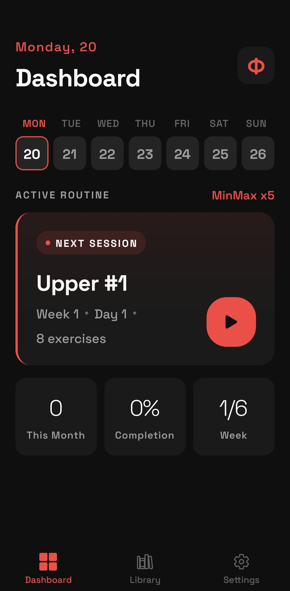
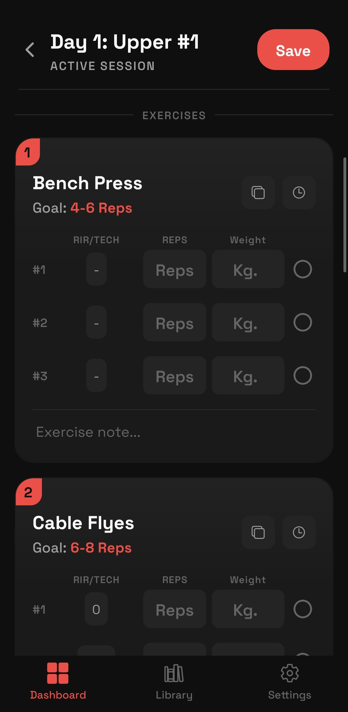

<p align="center">
  
</p>

<h1 align="center">GymLog</h1>

<p align="center">
  <strong>A program-first workout tracker built for structured training.</strong>
  <br />
  Design periodized programs. Log every set. Stay on track.
</p>

<p align="center">
  
  
  
  
  
</p>

<p align="center">
  
  &nbsp;&nbsp;&nbsp;&nbsp;
  
</p>

---

## Why GymLog?

Most gym apps focus on logging individual workouts. GymLog is built around **programs** — multi-week training blocks with structured days, exercises, sets, and progression targets.

If you follow periodized training (PPL, Upper/Lower, block periodization, etc.), GymLog lets you define the full template once and work through it session by session — tracking reps, weight, and RIR along the way.

> **100% offline. No account. No cloud. Your data stays on your device.**

---

## Features

| | Feature | Details |
|---|---|---|
| **Program Builder** | Design multi-week programs (4-20 weeks) with custom day splits and exercises. Configure sets with rep ranges, RIR targets, and technique cues. Exercise autocomplete from a built-in library of ~180 exercises. |
| **Dashboard** | Weekly calendar with completion status at a glance. Next session card, stats overview (workouts this month, completion %, week progress), and last workout summary. |
| **Workout Logging** | Log reps, weight, and RIR for every set. Copy weights across sets. View per-exercise history in a bottom sheet. Edit completed workouts without losing timestamps. |
| **Program Tracking** | Timeline view with week pills and progress %. Day cards show completed, current, and upcoming states. Tap any day to start or revisit. |
| **Import / Export** | Export all programs to JSON via the native share sheet. Import from backup with duplicate detection. |

---

## Tech Stack

| Layer | Technology |
|-------|-----------|
| Framework | React Native 0.81 + Expo SDK 54 |
| Language | TypeScript (strict mode) |
| Navigation | Expo Router (file-based) |
| Database | SQLite via `expo-sqlite` |
| Typography | Space Grotesk via `@expo-google-fonts` |
| Animations | Reanimated + Gesture Handler |
| File I/O | `expo-file-system` + `expo-sharing` |
| Icons | Ionicons via `@expo/vector-icons` |

---

## Getting Started

### Prerequisites

- [Node.js](https://nodejs.org/) (LTS recommended)
- [Expo CLI](https://docs.expo.dev/get-started/installation/)
- Android emulator, iOS simulator, or a physical device with [Expo Go](https://expo.dev/go)

### Installation

```bash
git clone https://github.com/Felixx00/gym-log.git
cd gym-log

npm install

npm start
```

Then press `a` for Android or `i` for iOS.

---

## Project Structure

```
app/
├── _layout.tsx                  # Root layout (theme + DB init + font loading)
├── (tabs)/
│   ├── (dashboard)/             # Dashboard -> program view -> workout logging
│   ├── library/                 # Program creation & editing
│   └── settings/                # Export & import
services/
├── database.ts                  # SQLite service layer
├── exportTypes.ts               # Export JSON schema (versioned)
└── exportValidator.ts           # Import file validation
components/
├── StyledText.tsx               # Text/TextInput with Space Grotesk font mapping
├── OverlayModal.tsx             # Animated modal overlay
├── ExerciseHistorySheet.tsx     # Draggable bottom sheet for exercise history
└── builder/                     # Builder-specific components
constants/
└── theme.ts                     # Dark theme color palette + font families
data/
└── exerciseSeed.json            # ~180 built-in exercises for autocomplete
```

---

## Database

SQLite with 6 tables: `programs` -> `weeks` -> `days` -> `exercises` -> `sets` + standalone `exercise_library`.

All foreign keys cascade on delete. Workout progress tracked via `completed` and `completed_at` on days. Set logging stores `weight`, `reps_done`, and `rir_done`.

Full schema and service API documented in [`docs/database.md`](docs/database.md).

---

## Roadmap

- [ ] Edit program metadata (name, weeks, days/week)
- [ ] Duplicate program
- [ ] Workout summary after save
- [ ] Progress & stats screen
- [ ] Rest timer
- [ ] Reorder exercises during workout
- [ ] Pre-built program templates

---

## License

This project is licensed under the [MIT License](LICENSE).
